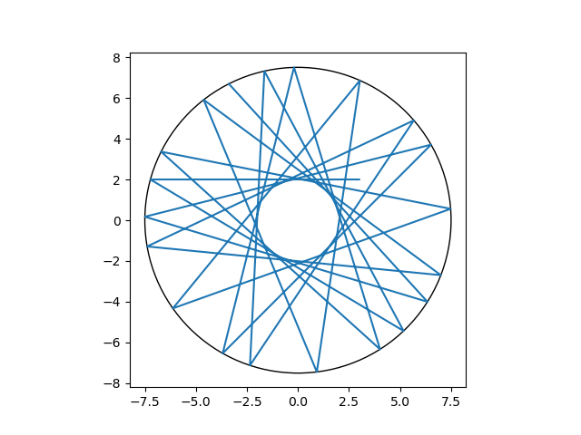
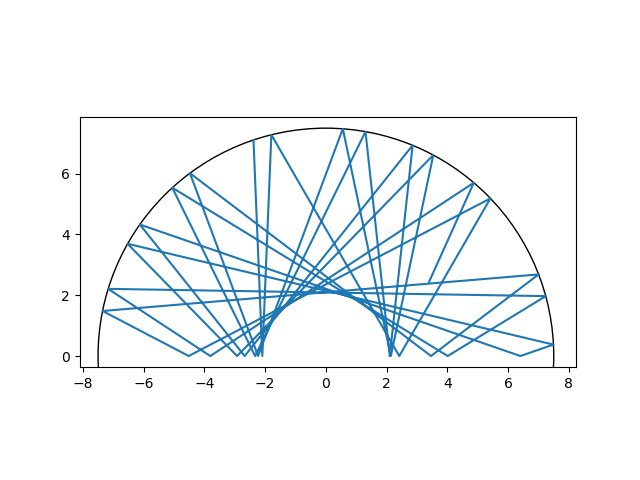

# Circular & Semi-circular Billiard Dynamics: Physics Simulator


A computational physics engine that simulates chaotic particle trajectories within circular and semi-circular boundaries. This project demonstrates numerical modeling in **C** combined with automated data visualization in **Python**.

<p align="center">
  
  <br>
  <em>Figure 1: Trajectory visualization of a particle undergoing elastic collisions in a circular boundary.</em>
</p>

<p align="center">
  
  <br>
  <em>Figure 2: Trajectory visualization of a particle undergoing elastic collisions in a semi-circular boundary.</em>
</p>

## Project Overview

This simulator models the motion of a point particle in an idealized billiard table (no friction, perfectly elastic collisions). It serves as a study of **dynamical systems** and **chaos theory**, where minor deviations in initial conditions can lead to significantly divergent trajectories (the butterfly effect).

### Features
- **Dual Physics Models:** Supports both **Circular** (closed system) and **Semi-Circular** (chaotic stadium-like) boundaries.
- **Hybrid Architecture:** 
  - **Core Engine (C):** Numerical integration using parametric equations and Descartes' law of reflection.
  - **Visualization (Python):** Automated plotting using `matplotlib` and `numpy`.
  - **GUI Launcher (Python):** `tkinter`-based control panel for user-friendly interaction.

## Technical Stack

- **C (C99 Standard):** Core simulation logic, memory management, and file I/O.
- **Python 3:** Data processing (`numpy`) and Visualization (`matplotlib`).
- **Bash/Shell:** Process automation.
- **GCC:** Compiler toolchain.

## Project Structure

```bash
├── billiard.c          # Main C simulation engine
├── plot_billiard.py    # Visualization script
├── launcher.py         # GUI Control Panel
├── README.md           # Documentation
└── .gitignore          # Build artifact exclusion
```

## How to Launch

### Prerequisites
Ensure you have the following installed:
- GCC Compiler (`gcc`)
- Python 3.x
- Python Libraries: `matplotlib`, `numpy`, `tkinter`

### 1. Compile the Simulation Engine
First, compile the C code using the math library linker (`-lm`):
```bash
gcc billiard.c -o simulation -lm
```

### 2. Run the Simulator
You can run the project via the GUI or the command line.

**Option A: Graphical Interface (Recommended)**
Launches the control panel to set parameters easily.
```bash
python3 launcher.py
```

**Option B: Manual Execution**
Run the engine directly in the terminal:
```bash
./simulation
# Follow the interactive prompts for Mode, X, Y, and Angle.
```

## Authors

**[Ahmed Benlafqih]**
- **LinkedIn:** [Ahmed Benlafqih](www.linkedin.com/in/ahmed-benlafqih)
- **Email:** [ahmed.benlafqih@proton.email](ahmed.benlafqih@proton.email)
**[Oumaima Berkani]**  co-author
- **Linkedin:** [Oumaima Berkani](https://www.linkedin.com/in/emmab0/)


## License

This project is open-source and available under the **MIT License**.

```text
MIT License

Copyright (c) 2026 Ahmed Benlafqih

Permission is hereby granted, free of charge, to any person obtaining a copy
of this software and associated documentation files (the "Software"), to deal
in the Software without restriction, including without limitation the rights
to use, copy, modify, merge, publish, distribute, sublicense, and/or sell
copies of the Software, and to permit persons to whom the Software is
furnished to do so, subject to the following conditions:

The above copyright notice and this permission notice shall be included in all
copies or substantial portions of the Software.
```
